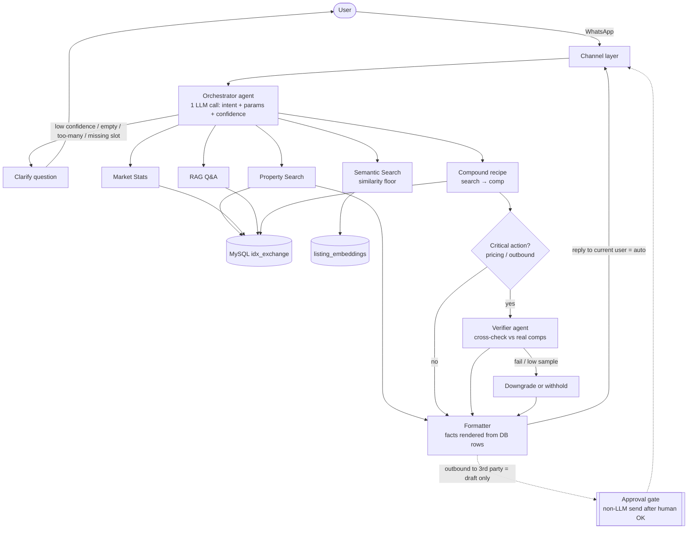

# Architecture

How a user query flows from WhatsApp through the agent runtime to the MLS databases,
and where the robustness mechanisms sit. (Design decisions: `idx-agent-design-decisions`.)

## Flow

## Components (handbook)
- **Channels** — WhatsApp / email / web interfaces.
- **Orchestrator** — routes each query to the right agent(s); deterministic router (not an autonomous loop).
- **Skills / Agents** — modular capability units (search, market, semantic, recommend, RAG, email).
- **Tools** — typed async functions agents call.
- **Sessions** — per-user state (current search filter, preferences).
- **Memory** — short-term session + long-term vector storage.

## Where robustness lives (priority: 丙 > 甲 > 乙)
- **丙 — no wrong outbound**: the LLM has no send tool. Outbound to third parties produces a
  `pending` draft only; a non-LLM path sends after explicit human approval. Replies to the
  current conversation are automatic.
- **甲 — no confident errors**:
  - *Grounding*: the model never authors facts — address/price/beds/etc. are rendered by the
    formatter from real DB rows, with provenance ids.
  - *Verifier agent*: critical outputs (pricing advice, outbound drafts) are cross-checked
    against real `california_sold` comps; weak sample → downgrade/withhold.
  - *Confidence from structure*: clarify on empty / huge / missing-slot / unmapped-term —
    not on the model's self-reported confidence.
  - *Semantic floor*: below threshold, say "no strong match" rather than forcing weak results.
- **乙 — always responsive**: each LLM-dependent step has a non-LLM fallback (regex parse →
  raw DB cards → deterministic comp thresholds). On conflict, 甲 beats 乙 (can't verify → withhold).

## Live path = TypeScript
The entire request path runs in TypeScript (orchestrator, agents, DB, query embedding, vector
math). Python is used only for **offline** batch jobs (embedding precompute → MySQL, data
cleaning) that do not run during a live request or the demo. → one process at demo time.

## Shared infrastructure (Week 1)
- `schema/columns.ts` — field dictionary, single source of truth for cryptic MLS column names.
- `src/config.ts` — env load + fail-fast validation.
- `src/db.ts` — connection pool + parameterized queries (injection guard; ≤50-row cap added Week 3).
- `src/logger.ts` — structured logs with mandatory secret redaction.
